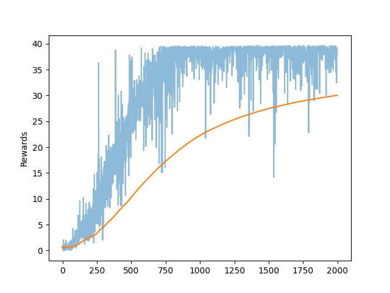

# P2-continuous-control
This project presents the Reinforcement Learning algorithm to solve the P2-Continuous-control project of the Udacity - 
Deep Reinforcement Learning course.

## Getting started
- Install Unity [python packages](https://github.com/Unity-Technologies/ml-agents/blob/main/docs/Installation.md)
- Set up the DRLND environment [here](https://github.com/udacity/deep-reinforcement-learning#dependencies)
- Download the Single Reacher environment from [here](https://s3-us-west-1.amazonaws.com/udacity-drlnd/P2/Reacher/one_agent/Reacher_Linux.zip)

### Set up
Unzip the file into the same folder of the DRL_ContinuousControl project
 
	unzip /PATH/TO/REACHER_ENV.zip /PATH/TO/DRL_ContinuousControl

Activate conda environment:
    
    conda activate drlnd

### Usage
The script _main.py_ can be executed with two options:

    Usage:
        --no_training : run a single episode
       --trainin : train the algorithm for 2k episodes

## The environment

The project environment comprises one robot with two spherical-joints, and a light blue sphere representing the target 
area for the robot end-effector.

The agent (the robot) can perform 4 continuous actions at every step. Every action represents the torque applied to one 
joint, and the admissible values are clipped between -1 and 1.

The environment provides a positive reward of +0.1, when the robot end-effector is inside the blue sphere, and zero otherwise. 
 
## The method
The presented solution employs the Deep Deterministic Policy Gradient (DDPG) method. 

This method is a model-free off-policy learning algorithm suitable for continuous actions. It belongs to the groups of 
actor-critic methods, which extends policy gradient and q-values methods. Two independent networks are used for the actor
and the critic. The former provides the best action given the state, and the latter provides the q-value for a pair (state, action). 
These two networks are used in combination to learn the best policy by proposing a policy (actor) and criticising the results
using the q-values (critic).

Because the critic uses a DQN, the algorithm can be seen as an extension of DQN to continuous action space. Similarly to DQN, 
DDPG approximate the Q-table, and mitigation techniques must be considered to avoid instabilities. DDPG uses a replay-buffer and a target
network. The former stores experience coming from past episodes in the shape of tuples (state, action, reward, next_state, done), 
the latter mitigates the problem of learning by using a moving target, and represents a copy of the network updated with 
a certain delay.

Both actor and critic use two networks: a target and a local.

A common method to balance exploitation and exploration is using epsilon-greedy policies. This method uses the current 
best policy with probability (1 - epsilon) and explores a uniformly random generated action with probability (epsilon). 
However, DDPG commonly substitute this method with a soft-update (polyak method) of the target policy, and a noise to the 
predicted actions. 

DDPG does not learn at avery step. To avoid overfitting, the method learns only a certain number of steps, so that new
experience is available in the replay buffer. Moreover, the learning phase is repeated several times once the learning 
is activated.

## Important insights throughout the implementation

Throughout the implementation a few important elements have emerged:

- The **noise** added to the actions makes a huge difference in the learning of the algorithm. Initially, we implemented
    the Ornstein–Uhlenbeck process, which is inspired by the velocity of Brownian particles. However, the learning was 
    very unstable, and we could not obtain reliable results. Therefore, we moved to the Gaussian noise at zero mean (as suggested
    byOpenAI). Thanks to this type of noise, the algorithm increased in robustness and stability.
- The **lean every N step** and the **learning per step** numbers make a big impact on the learning phase. Initially, 
  we set (20, 10) respectively, but the networks were very unstable, especially in the first 100 iterations, with a very 
    slow learning rate. Therefore, we increased the number to (50, 40), and the algorithm started to learn faster and more
    robustly.

## RL Hyperparameters
_Max number of episodes_: 2000

_Max time per episode_: 1000

_Gamma_: 0.99

_learn every N step_: 50

_learning per step_: 40

_Replay Buffer_: 1e6

_Batch size_: 128

_Soft update value_: 0.9999

## NN Hyperparameters

### Actor 
Network structure: One Regularisation layer, two linear layers with ReLu activation, and a hyperbolic tangent as output layer

_First Hidden Layer_ = 128 nodes

_Second Hidden Layer_ = 128 nodes

### Critic 
Network structure: One Regularisation layer, two linear layers with ReLu activation, and a linear layer
This network takes in the state and the action, but the action are fed inside the network only _after_ the first linear layer

_First Hidden Layer_ = 128 nodes

_Second Hidden Layer_ = 128 nodes

## The result
We consider the algorithm finished when an average value of +30.0 is reached. 

The learning graph below shows that we reach the target after roughly 500 iterations, the network touches the ceiling of
+40 after roughly 750 iterations.

## Future work
